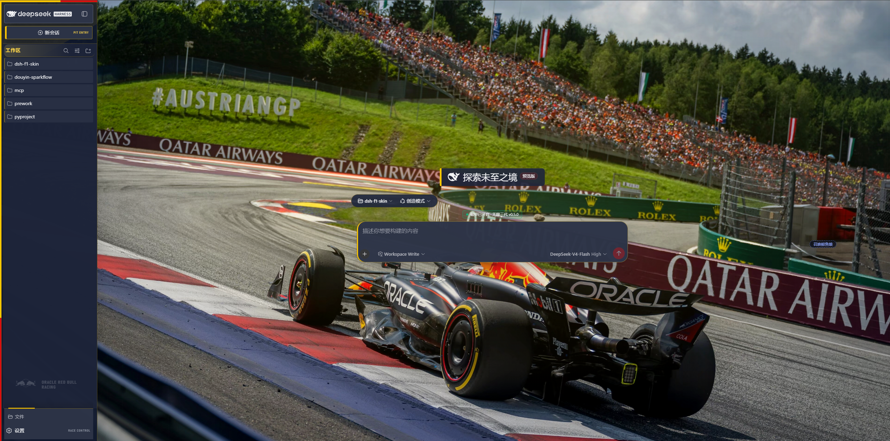

# dsh-f1-skin 🏁

*An F1 Race Control themed skin for the DeepSeek Harness Web UI.*

[](https://github.com/frank-fan-818/dsh-f1-skin/actions/workflows/ci.yml)
[](LICENSE)
[](https://github.com/deepseek-ai/deepseek-harness)

> [!IMPORTANT]
> 这是一个**非官方、非商业的开源粉丝项目**，与 Formula 1、FIA、DeepSeek
> 或任何车队不存在隶属、赞助、认可或合作关系。Formula 1、F1、车队名称、
> 标志、赛车涂装及相关商业外观归各自权利人所有。代码采用 MIT；内嵌照片和
> 标志不因此转为 MIT，完整来源与再分发条件见
> [THIRD_PARTY_NOTICES.md](THIRD_PARTY_NOTICES.md)。

> **dsh-f1-skin 是给 DeepSeek Harness Web UI 写的一台「赛事控制中心」。**
>
> 它把 F1 的转播美学带进你的 AI 工作台：红牛、法拉利、迈凯伦、梅奔四支车队的完整主题，一键切换——每队拥有独立的品牌色、对比度文本、车队性格和专属赛车摄影背景，并完整跟随 DSH 的浅色 / 深色 / 跟随系统三档主题。
>
> 与普通换肤不同，它按「设计系统」而非「样式覆盖」来工作：背景场景、阅读材质、工作组件、真实运行状态、车队 DNA 被拆成五个独立层级——照片只负责气氛，文字可读性由局部材质保证，界面运行状态直接映射 DSH 真实的 `data-state`，**不做虚假的 LIVE 播报，也不遮挡任何宿主功能**。所有控制（车队选择、背景强度、文字衬底、模糊、动效）都住在 DSH 官方的「设置 → Formula One 车队」面板里，卸载即恢复原样。

仓库：[github.com/frank-fan-818/dsh-f1-skin](https://github.com/frank-fan-818/dsh-f1-skin)

## 实机画面

以下截图来自 DSH Web `0.1.1-rc.2`，背景强度 100%、文字衬底 84%、背景模糊
10px；图片没有脱离真实界面单独合成。

| Oracle Red Bull Racing | Scuderia Ferrari |
|---|---|
|  |  |

| McLaren Racing | Mercedes-AMG Petronas Formula One Team |
|---|---|
|  |  |

原生设置页不会浮在输入框上方抢占宿主层级：


四套车队主题（红牛 / 法拉利 / 迈凯伦 / 梅奔），每队使用对应的 2024 F1 赛车动态摄影背景。皮肤把背景场景、阅读材质、工作组件、真实运行状态和车队性格拆成独立层级，并继续跟随 DSH 的浅色 / 深色 / 跟随系统三档。

| 车队 | 品牌主色 | 辅助色 |
|---|---|---|
| 🔴 Red Bull 红牛 | `#FFC800` 红牛黄 | `#D90F0F` 红牛红 |
| 🟥 Ferrari 法拉利 | `#DC0000` 法拉利红 | `#FFF200` 摩德纳黄 |
| 🟠 McLaren 迈凯伦 | `#FF8000` 木瓜橙 | `#47C7FC` 迈凯伦蓝 |
| 🟢 Mercedes 梅奔 | `#00D2BE` 石油绿 | `#B4B5B7` 梅奔银 |

## 特性

- **照片优先**：赛车摄影是独立场景层；导航、输入、代码和工具结果分别使用局部材质，不再以全局暗幕牺牲背景。
- **主题 token**：覆盖 DSH 全部 79 个 `--dsw-alias-*` / `--dsw-specific-sidebar-fill` 设计变量，通过 `theme.overrideTokens` 叠加——官方外观三档开关照常工作。
- **组件语言**：输入框、消息、推理、工具调用、代码块、菜单和弹层共用精密边线、数据字体和局部状态条。
- **真实状态**：直接使用 DSH 的 `data-state` 表现运行、完成和错误，不显示虚假的 `LIVE` 或 `TEAM RADIO`。
- **原生 F1 设置页**：通过 DSH 官方 `settings.section` slot 切换车队，并调整照片强度、文字衬底、模糊和动效；不会悬浮遮挡对话或宿主功能。
- **HTTP 照片层**：赛车摄影由宿主路由（`/plugin-assets/dsh-f1-skin/*`）以静态文件下发，不再内联进 JS——没有约 2MB 的 data-URI 限制，因此支持 4K 及以上分辨率；红牛背景当前为 4K 摄影原图。
- **自定义壁纸（按车队）**：设置页可为每个车队单独上传 JPEG/PNG/WebP（≤25MB）背景；相同图片只存一份（按内容哈希去重）；已上传壁纸库支持随时「应用 / 删除」，删除会同步清掉所有车队对它的引用。选择存于 `localStorage`，图片文件存于 `$DSH_HOME/dsh-f1-skin/custom/`。想替换内置背景图，覆盖 `assets/cockpits/<队名>-broadcast.jpg` 后运行 `npm run build` 即可。
- **记忆**：车队、视觉参数与自定义壁纸选择保存在本机 `localStorage`，刷新后保持。

## 安装

### 0. 先安装 DSH CLI

本皮肤是 DSH Web 的插件，不能脱离 DSH 单独运行。请先安装 Node.js 20 或更高
版本，再全局安装与本皮肤兼容的 DSH CLI：

```powershell
npm install -g @deepseek-ai/dsh@0.1.1-rc.2
dsh --version
```

版本检查应输出 `0.1.1-rc.2`。如果 PowerShell 报错
`无法将“dsh”项识别为 cmdlet、函数、脚本文件或可运行程序的名称`，说明 CLI
尚未安装成功或 npm 全局目录不在 `PATH` 中。安装后请重新打开 PowerShell；仍然
无法识别时，运行 `npm config get prefix`，并把输出的目录加入用户 `PATH`。

> 如果 PowerShell 提示脚本执行策略禁止运行 `dsh.ps1`，可将下文命令中的
> `dsh` 临时改为 `dsh.cmd`。

### 方式一：npm（推荐）

```powershell
dsh plugin --profile web add dsh-f1-skin
```

### 方式二：GitHub 仓库

```powershell
dsh plugin --profile web add github:frank-fan-818/dsh-f1-skin
```

> 仓库已提交构建产物（`lib/client.js` 与 `lib/cockpits/` 照片），无需安装步骤里的 build 脚本；请确保两者随仓库 / npm 包一起发布。

### 方式三：下载源码 / ZIP 后本地链接

```powershell
# 在解压后的仓库目录执行
dsh plugin --profile web add link:.
# Windows 且路径含空格时，dsh 转发器会拆词，改用 pnpm 直装 + 手动 reconcile：
#   cd $DSH_HOME/profiles/web
#   pnpm add "link:D:\path\to\dsh-f1-skin"
#   node D:\path\to\dsh-f1-skin\scripts\reconcile-profile.mjs
```

安装后**重启 `dsh web`**，打开 http://127.0.0.1:3080；前往「设置 → Formula One 车队」切换车队、调节视觉强度，并为各车队上传 / 管理自定义壁纸。宿主照片与壁纸路由在重启后挂载，**重启前自定义壁纸的上传 / 列表 / 删除接口不可用**。

### 更新

```bash
dsh plugin --profile web update dsh-f1-skin
```

## 卸载

```bash
dsh plugin --profile web remove dsh-f1-skin
```
